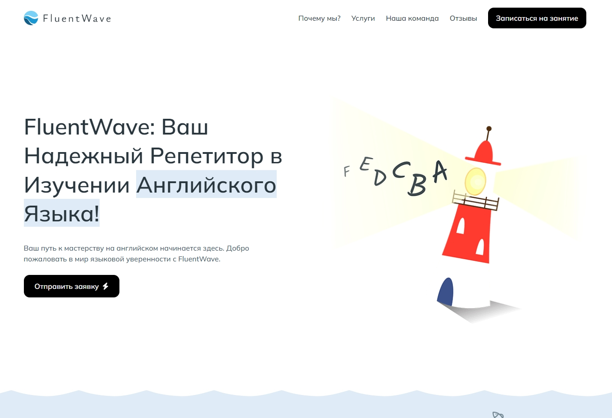
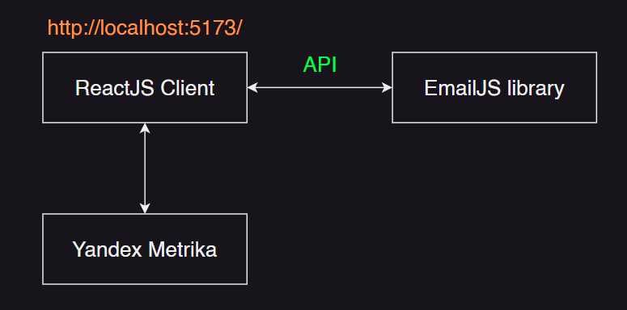

<!-- --------STATS-------- -->
 

<!-- --------LOGO-------- -->

	
	
<strong>FluentWave</strong> - Ваш Надежный Репетитор в Изучении Английского Языка!

	<a href="https://fluent-wave.web.app/" target="_blank">Открыть страницу</a>

<!-- --------ABOUT THE PROJECT-------- -->

## О проекте

	

<strong>FluentWave</strong> - использует следующие технологии:

<ul>
	<li>Yandex Metrika</li>
	<li>TypeScript</li>
	<li>Vite</li>
	<li>React JS</li>
	<li>React Router</li>
	<li>React Hook Form</li>
	<li>CSS Modules (SCSS)</li>
	<li>Swiper JS</li>
	<li>Font Awesome Icons</li>
	<li>Email JS</li>
	<li>AOS library</li>
</ul>

<!-- APP ARCHITECTURE  -->

## Архитектура приложения

	

<!-- --------SET UP INSTRUCTIONS-------- -->

## Инструкция по запуску приложения

Выполните установку необходимых вам зависимостей с помощью `npm i`. Далее создайте файл `.env.local`, в него перепишите переменные с вашими реальными значениями API из файла `.env.example`. После чего запустите проект в браузере, выполнив команду `npm run dev`.

<!-- --------CONTRIBUTING-------- -->

## Контрибуция

Контрибуция делает сообщество с открытым исходным кодом удивительным местом для обучения, вдохновения и творчества. Любой ваш вклад **высоко ценится.**

Если у вас есть предложение по улучшению, пожалуйста, сделайте fork репозитория и создайте pull request. Вы также можете просто создать issue с меткой "enhancement".
Не забудьте поставить star проекту! Спасибо еще раз!

1. Fork репозиторий
2. Создайте вашу Feature Branch (`git checkout -b feature/AmazingFeature`)
3. Сделайте коммиты с изменениями (`git commit -m 'Add some AmazingFeature'`)
4. Push в ветку (`git push origin feature/AmazingFeature`)
5. Откройте Pull Request

<!-- --------LICENSE-------- -->

## Лицензия

Распространяется по лицензии GNU. Смотрите `LICENSE` для получения дополнительной информации.

<!-- --------CONTACT-------- -->

## Связь со мной

Очагов Данил

Email: danilochagov@gmail.com

Telegram: @danilochagov

VK: https://vk.com/danilochagov

Ссылка на Github проект: https://github.com/ochagovdanil/fluent-wave
